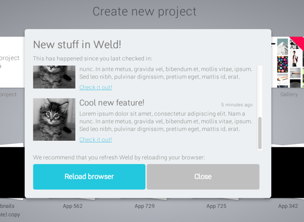

# UpToDater

UpToDater is a backend API for an in-app service that checks if the app has been updated since the last time the user logged or refreshed their browser.

It was inspired by Wufoo's similar service, as described by founder Kevin Hale in [“How to Build Products Users Love”](http://startupclass.samaltman.com/courses/lec07/) in How to Start a Startup.

## Usage

Note: this is currently the **backend only**.

Example:

	curl http://localhost:3002/api/updates?from=1991-01-03

...would return a list of updates since Scorpions released "Wind of Change", or an empty JSON array if nothing had changed.

## Implementation

UpToDater is based on the [Yeoman Express generator](https://github.com/petecoop/generator-express) with the "MVC" option.

## How to Run

Just start with:

	grunt

Server will default to **http://localhost:3002**

## Queries

List new:

	curl http://localhost:3002/api/updates?from=2014-11-28

List all:

	curl http://localhost:3002/api/updates

Add new update:

	curl -X POST -H "Content-Type: application/json" -d '{ "title": "Minimum post" }' http://localhost:3002/api/updates?password=[PASSWORD]

	curl -X POST -H "Content-Type: application/json" -d '{ "title": "My title", "description": "Bla bla bla", "reloadNeeded": false }' http://localhost:3002/api/updates?password=[PASSWORD]

	curl -X POST -H "Content-Type: application/json" -d '{ "title": "Cool new feature!", "description": "Lorem ipsum dolor sit amet, consectetur adipiscing elit. Nam a nunc. In ante metus, gravida vel, bibendum et, mollis vitae, ipsum. Sed leo nibh, pulvinar dignissim, pretium eget, mattis id, erat.", "authors": "Henric, Andres", "url": "http://placekitten.com", "imageUrl": "http://placekitten.com/g/300/300", "reloadNeeded": true, "priority": 2 }' http://localhost:3002/api/updates?password=[PASSWORD]

Delete update:

	curl -X DELETE http://localhost:3002/api/updates/5477a6f88906b9fc766c843e?password=[PASSWORD]